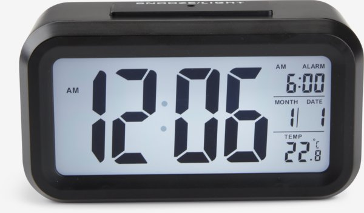
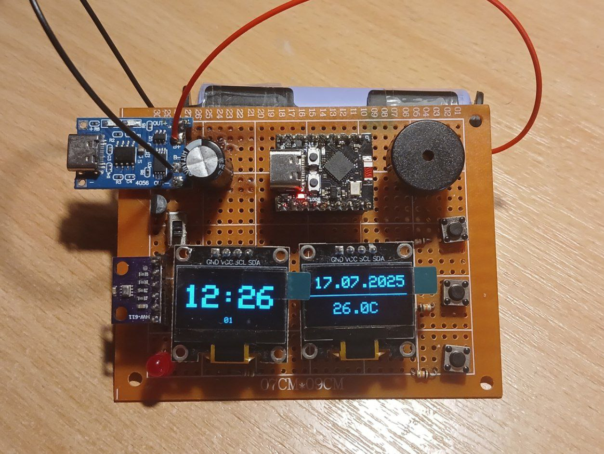
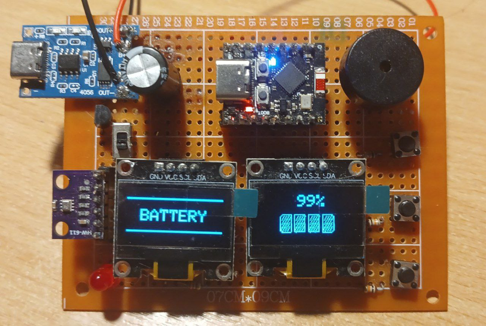
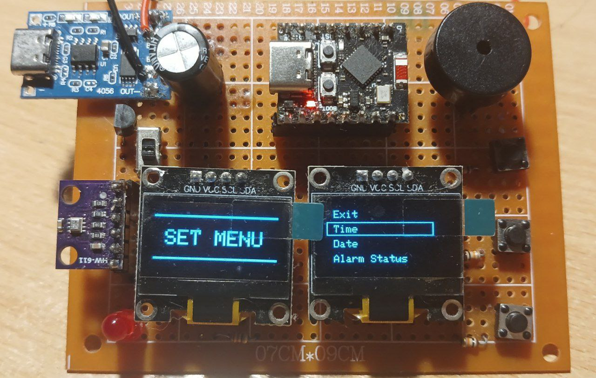
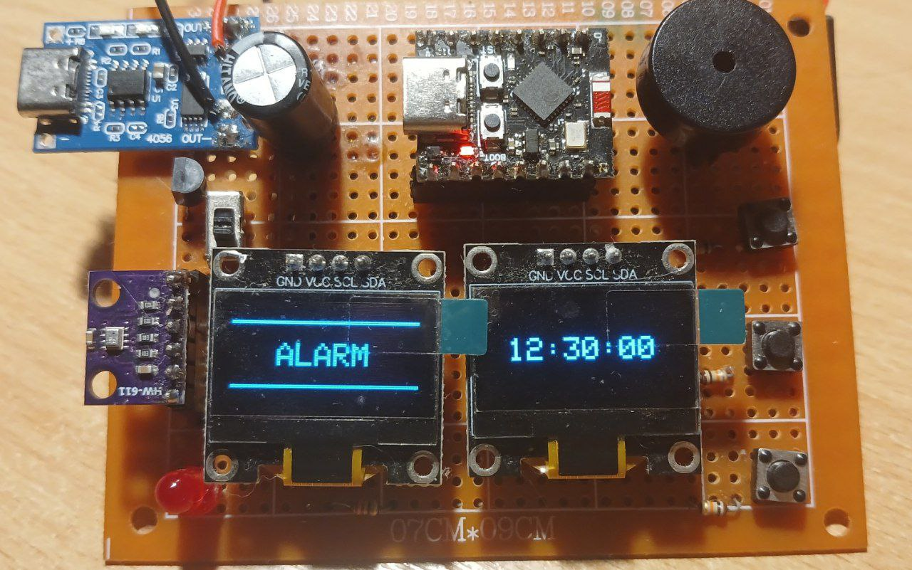
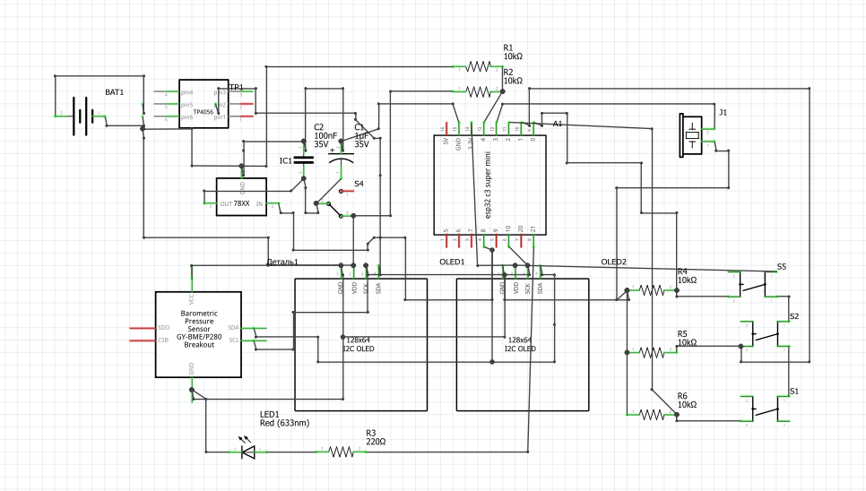
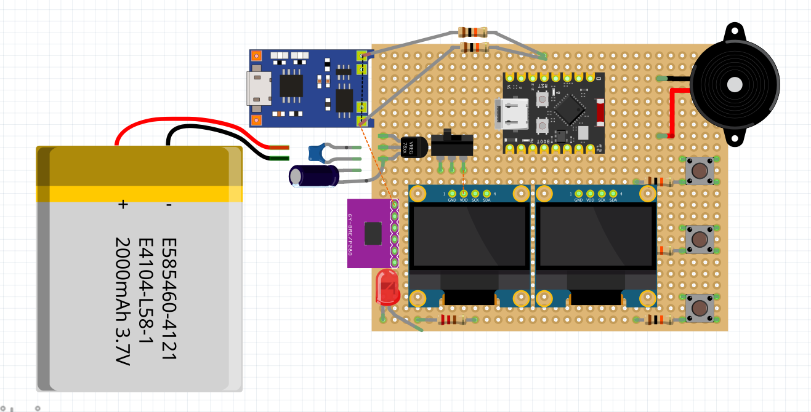
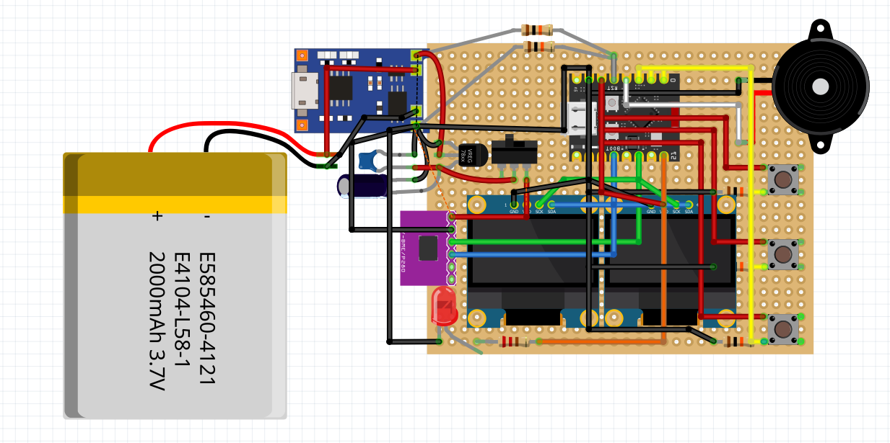

#  ESP32 CLOCK

> This project was made with **PlatfornIO** VSCode extension. If you're using **Arduino IDE**, please copy code from `src/main.py`.

This project was attempt to reverse engineer this clock and recreate my version using ESP32 microcontroller.

And here is my version:

It may look not as pretty as reference, but it works just as the other and has additional features!

## What functionality does it have?
 - **Three buttons for controll**: UP, SET, DOWN.

 - **Charging module**. While charging the red indicator will light up. Once charge, the red one will turn off and green will light up instead.

 - **Showing time and date**.

 - **Reading temperature** in the room/surrounding area.

 - **Alarm**. It will play a little alarm sound where the time comes.

 - **Sleep**. To preserve battery and not to annoy you with bright light during your sleep, you can set time when clock will go into sleep. You can still check time by waking up using SET button and screen will show the time for 10 seconds.

 - **Settings menu**. Here you can:
    - Set current time and date
    - Set alarm time and turn it off/on
    - Set sleep start and end time + turn on/off the sleep.
    - Turn on or off seconds displayment
    - Check battery charge (aproximate)

 **NOTE**: PLEASE DON'T PLUG CHARGING MODULE AND ESP32 USB-C PORT AT THE SAME TIME! IT WILL CAUSE DAMAGE TO THE CHIP! 
## Technical specifications
 - **Current draw**: **~8 mA** in normal mode and **~0.07 mA** in sleep/
 - **Battery**: 18650 3.7V Li-on battery. 
 - **Battery capacity**: 2000mAh (but you can change to your needs).
 - **Time between charging**: **~8 days** and **~12.5** days using sleep mode for 9 hours a day.
 - **Time drift**: clock losses **1 minute each 5 days**.

**NOTE**: Because this clock doesn't uses external RTC module, it has unavoidable time drift. Please be aware.

## Requirenments
 | Part | Quantity |
 | -----|:-------:|
 | ESP32-C3 SUPER MINI | 1 |
 | SSD1306 OLED 128x64 display | 2 |
 | BMP280 HW-611 sensor | 1 |
 | TP4056 charging module | 1 |
 | 18650 3.7V 2000mAh battery | 1 |
 | 18650 battery case | 1 |
 | Buzzer | 1 |
 | Red LED | 1 |
 | Push-button | 3 |
 | Slide-switch | 1 |
 | 10kOm Resistor | 5 |
 | 220Om Resistor | 1 |
 | HT7833 3.3V TO-92 LDO | 1 |
 | 1000uF Electrolytic capacitor | 1 |
 | 100nF Ceramic capacitor | 1 |

 **Optional:** You can use female pin header to connect esp32, displays sensor and buzzer to be able to reuse this assets in other projects or to replace if something fails. You can buy a one or two 40-pin one and chop it to pieces of all sizes you need or buy this female pin connectors.
 |Part | Quantity|
 |-----|:-------:|
 | 1-pin female pin connector | 2 |
 | 4-pin female pin connector | 2 |
 | 6-pin female pin connector | 1 |
 | 8-pin female pin connector | 2 |

 1-pin are used for Buzzer, 4-pin for displays, 6-pin for temperature sensor and 8-pin for esp32.

## Schematic
Here you can download <a download href="./Clock_Alarm.fzz">fritzing schematic</a> to build clock yourself.

**Schematic**

**Prototype view**

**Prototype view with wires**

**ESP32 C3 SUPER-MINI PINOUT**

----